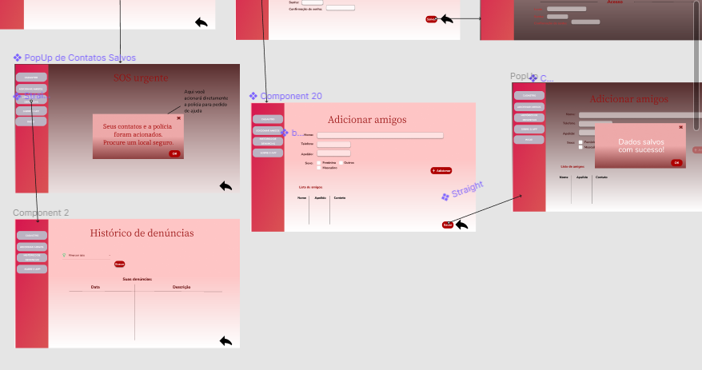

# Projeto de Interface

Pré-requisitos: <a href="2-Especificação.md"> Documentação de Especificação</a>

> Apresente as principais a interface da plataforma. Discuta como ela
> foi elaborada de forma a atender os requisitos funcionais, não
> funcionais e histórias de usuário abordados nas [Especificações do
> Projeto](2-Especificação.md).

## User Flow

###  Mobile

### Web

> Fluxo de usuário (User Flow) é uma técnica que permite ao desenvolvedor
> mapear todo fluxo de telas do site ou app. Essa técnica funciona
> para alinhar os caminhos e as possíveis ações que o usuário pode
> fazer junto com os membros de sua equipe.

> - [Apresentação do Protótipo feita através do Figma](https://www.figma.com/proto/DRne8pFlN4b5Oz9PW639nm/Violencia-contra-mulher?node-id=18%3A3851&scaling=min-zoom&page-id=0%3A1&starting-point-node-id=18%3A3851&show-proto-sidebar=1)
