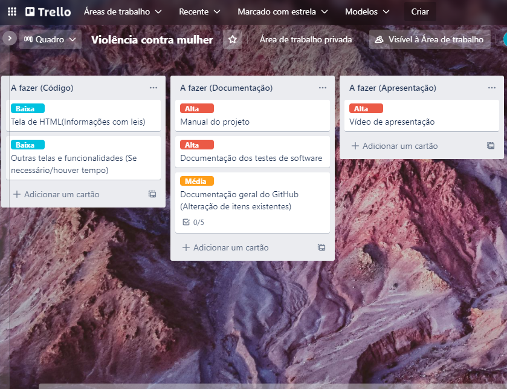
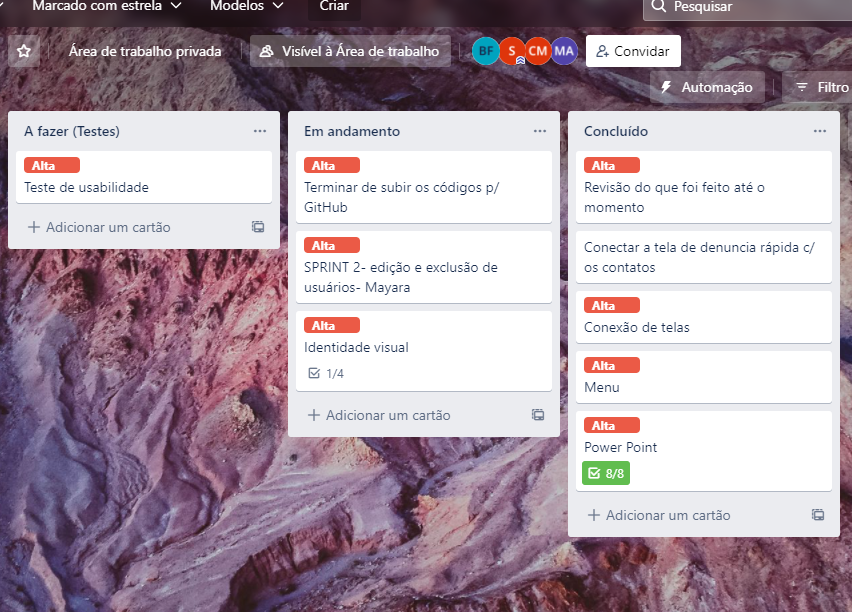

# Gerenciamento de Projeto
 
## Divisão de Papéis
 
Durante o processo de Design Sprint o grupo teve os professores Simone Alves Nogueira, Rommel Vieira Carneiro, Nathalia Assis Valentim como POs do projeto (Product Owners), o ex-aluno da PUC Bruno Marini como Scrum Master e facilitador do processo e os membros do grupo foram desenvolvedores. No grupo não havia a posição única de líderes, todos tinham a possibilidade de liderar.
 
Quando a etapa de implementação do projeto, os membros da equipe fizeram os seguintes artefatos.
 
- Mayara Roque Rangel: Tela de Login e Tela de Cadastro de Usuários
- Camila Mariana Silva: Tela de Quiz e Tela de Comentários das Usuárias
- Samara Martins Ferreira: Tela para Adicionar Amigos, Tela de Disfarce (Para entrar na aplicação web)
- Bruno Gomes Ferreira: Tela de Denúncia Completa e  Tela de Mapa de Informações
- Pedro Henrique Pessoa Cruz: Tela Inicial (Landing Page), Tela de Denúncia Rápida
 
## Processo
 
O grupo já havia criado o hábito de reunir-se devido à etapa do Design Sprint, sendo assim foi dado a continuidade dessas reuniões durante a etapa de implementação da solução. As reuniões tinham o intuito de responder três perguntas: O que está sendo feito, quais as dificuldades encontradas e quais os próximos passos para solucionar o problema, fazendo essas três perguntas possibilitou-se que essas reuniões fossem bem rápidas e objetivas.
Também foi feito o uso do quadro do Trello para fazer o acompanhamento do andamento do projeto de forma online, o quadro foi disposto de forma que haviam cards relacionados ao que deveria ser implementado, o que estava sendo feito no momento e o que já havia sido terminado do projeto. Além disso, cada card possuía uma etiqueta com a sua prioridade, sendo divididas em baixa, média e alta prioridade. Vale observar que a utilização desse quadro combinado com a dinâmica feita durante as aulas para validar o que já havia sido feito e o que era necessário fazer foi de grande valia e serviu como um impulso para a criação deste quadro no Trello. Por fim,  a figura abaixo mostra a figura utilizada pelo grupo.
 

 
## Ferramentas
 
As ferramentas empregadas no projeto são:
 
- Editor de código.
- Ferramentas de comunicação
- Ferramentas de diagramação
- Ferramentas de gerenciamento
 
O editor de código VS Code foi escolhido porque ele possui uma integração com o sistema de versão. Além disso, as suas extensões dão a possibilidade de promover aos membros do grupo a possibilidade de customizar o editor da forma que desejarem.  
 
As ferramentas de comunicação utilizadas foram Microsoft Teams devido a sua praticidade já que todos os membros têm acesso a essa ferramenta.  
 
Para criar diagramas utilizamos essa ferramenta Figma por melhor captar as necessidades da nossa solução e permitir com que pudéssemos testar  
 
Por fim, como ferramenta de gerenciamento foi utilizado o Trello, através dele foi possível criar um `board ' onde os membros do grupo poderiam ver as pendências do projeto de acordo com ordem de prioridade.
 
